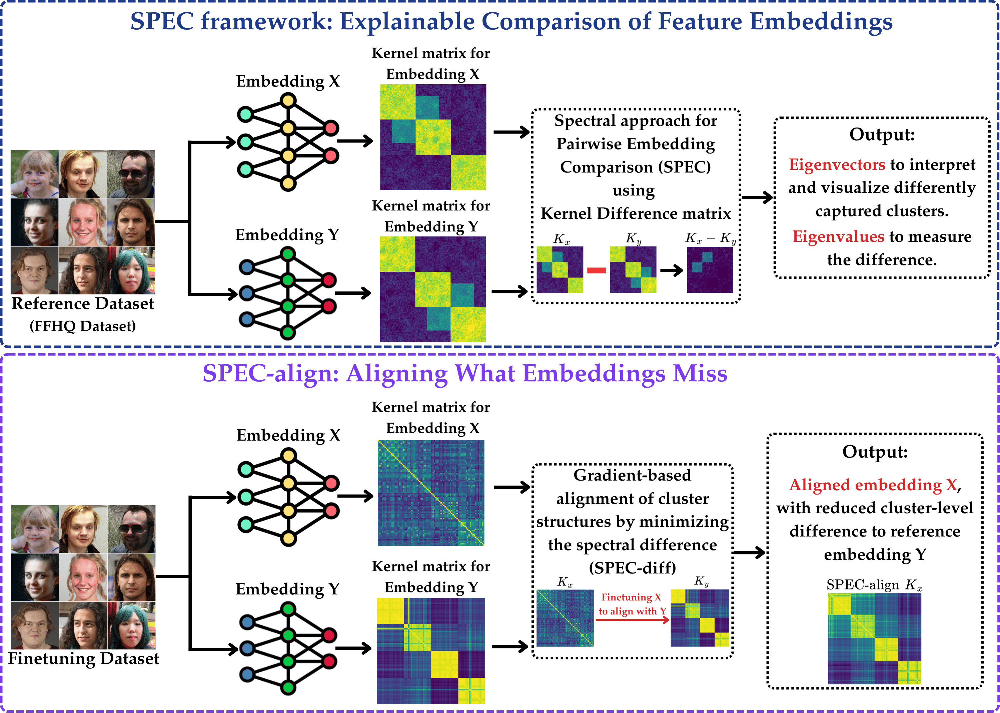

# embedding-comparison
[ICML 2025] Official implementation of SPEC method for interpretable embedding comparison.

paper: Towards an Explainable Comparison and Alignment of Feature Embeddings

[Website](https://mjalali.github.io/SPEC), [OpenReview](https://mjalali.github.io/SPEC/)


[Mohammad Jalai](https://mjalali.github.io/) <sup>1</sup>, Bahar Dibaei Nia <sup>2</sup>,
[Farzan Farnia](https://www.cse.cuhk.edu.hk/people/faculty/farzan-farnia/) <sup>1</sup>

<sup>1</sup> <sub>**The Chinese University of Hong Kong (CUHK)**</sub>

<sup>2</sup> <sub>**Sharif University of Technology**</sub>

## Abstract

Feature embedding models have been widely applied to many downstream tasks across various domains. While several standard feature embeddings have been developed in the literature, comparisons of these embeddings have largely focused on their numerical performance in classification-related downstream applications. However, an interpretable comparison of different embeddings requires identifying and analyzing mismatches between similar sample groups clustered within the embedding spaces. In this work, we propose the \emph{Spectral Pairwise Embedding Comparison (SPEC)} framework to compare embeddings and identify their differences in clustering a benchmark dataset. Our approach examines the kernel matrices derived from two embeddings and leverages the eigendecomposition of the differential kernel matrix to detect sample clusters that are captured differently by the two embeddings. We present a scalable implementation of this kernel-based approach, with computational complexity that grows linearly with the sample size. Furthermore, we introduce an optimization problem using this framework to align two embeddings, enhancing interpretability by correcting potential biases and mismatches, and ensuring that clusters identified in one embedding are also captured in the other. Finally, we provide numerical results showcasing the application of the SPEC framework to compare and align standard embeddings on large-scale datasets such as ImageNet and MS-COCO.

## Overview of SPEC



## What is SPEC?

Modern embedding models—such as CLIP and DINOv2 deliver strong downstream accuracy, yet numerical scores alone do not explain *how* the embeddings differ. SPEC fills this gap.

Given two embeddings, SPEC

1. Computes a kernel matrix for each embedding over a reference dataset.  
2. Forms their *difference* kernel.  
3. Spectrally decomposes that difference.  

Each eigenvector identifies a cluster of samples that one embedding groups but the other does not; the associated eigenvalue quantifies the strength of that mismatch.

The naïve eigen-solve scales as O(n³). SPEC avoids that cost: for bounded feature dimension *d* (or its random-Fourier proxy) the key eigenspace is recoverable in O(max{d³, n}) time—linear in sample size for practical *d* values.

---

## Project Structure

```

embedding-comparison/
├── spec/       # Spectral Pairwise Embedding Comparison Class
└── spec-align/      # SPEC-align: gradient-based embedding alignment

````

---

# 1. SPEC, Comparing two Embeddingd

This example demonstrates how to compare embedding spaces across vision backbones using **SPEC**. The script loads pre-computed features, computes covariance matrices, and visualizes the results.

---

## Data Preparation

Prepare pre-computed features for two models you want to compare. Save them as `.npz` files containing arrays with feature vectors:

You can use `spec/extract_features.py` script to do that.

```
dino_features.npz         # contains key 'dino_features'
clip_features.npz         # contains key 'clip_features'
```

Prepare a directory of raw images (any common format like `.jpg` or `.png`) corresponding to the feature vectors. The script will glob files directly from the folder:

```
images/
 ├── 000001.png
 ├── 000002.png
 ├── ...
```

---

## Running SPEC

The compare_embeddings.ipynb will do the following:

1. Load two feature sets (e.g., DINO and CLIP).
2. Collect image paths directly from the given folder.
3. Create an `ImageFilesDataset`.
4. Compute SPEC embeddings using covariance matrices.
5. Save a scatterplot of eigenvalues (`compare_cholesky.png`).
6. Visualize top modes via `visualize_modes_covariance`.

---

## Code Overview

* **Load features:**

```python
dino_features = np.load('dino_features.npz')['features']
clip_features = np.load('clip_features.npz')['features']
```

* **Load image paths:**

```python
from glob import glob
image_paths = sorted(glob('./images/*.png'))
```

* **Dataset:**

```python

# If you have a list of image_paths:
dataset = ImageFilesDataset(path='', name='dataset-name',
                            path_files=image_paths,
                            transform=transform,
                            extension='png')

# If you want to pass the directory of images:
dataset = ImageFilesDataset(path='path-to-images-directory', name='dataset-name',
                            path_files=None,
                            transform=transform,
                            extension='png')
```


* **Choose kernel bandwidths ($\sigma$ values)** 

The Gaussian-kernel bandwidth σ controls how fast similarity decays with distance.

* If $\sigma$ is **too small**, the kernel becomes nearly diagonal; every point looks unique and clustering signals disappear.
* If $\sigma$ is **too large**, the kernel approaches a constant matrix; meaningful structure is washed out.

Tips to choose $\sigma$: You can plot the spectrom of eigenvalues (plot `cov_x` or `cov_y` eigenvalues using torch.linalg.eigh) and change the $\sigma$ untill you see eigenvalues are seperated well.

Example working values:

```python
sigma_clip = 3.5
sigma_dino = 25.0
```


* **Run SPEC:**

```python
cov_x, _, x_feature = gaussian_covariance(torch.from_numpy(dino_features).float(),
                                          rff_dim=3000, batchsize=16,
                                          sigma=sigma_dino, return_features=True)

cov_y, _, y_feature = gaussian_covariance(torch.from_numpy(clip_features).float(),
                                          rff_dim=3000, batchsize=16,
                                          sigma=y_sigma, return_features=True)

eigenvalues, eigenvectors = DiffEmbed.compute_by_covariance_matrix(
    x=dino_features, y=clip_features, phi_x=x_feature, phi_y=y_feature,
    eta=1, method='cholesky'
)
```

* **Plot and visualize:**

```python
plt.scatter(eigenvalues.real.cpu(),
            [0]*eigenvalues.shape[0],
            s=5, c='blue')
plt.savefig('compare_cholesky.png')

visualize_modes_covariance(
    eigenvalues, eigenvectors,
    x_feature, y_feature,
    num_visual_mode=10,
    save_dir='visualize_clusters/',
    dataset=dataset,
    num_samples_per_mode=20,
    x=dino_features, y=clip_features,
    model_names=('DINOv2', 'CLIP')
)
```


---

## Contributions

* SPEC: kernel-difference eigendecomposition for explainable embedding comparison
* Linear-time computation via random Fourier features
* SPEC-diff: spectral distance measuring maximal cluster mismatch
* SPEC-align: gradient-based method to align embeddings (in `spec-align/`)

---

## Cite our work

```bibtex
@inproceedings{
    jalali2025spec,
    title={Towards an Explainable Comparison and Alignment of Feature Embeddings},
    author={Mohammad Jalali and Bahar Dibaei Nia and Farzan Farnia},
    booktitle={Forty-second International Conference on MachineLearning},
    year={2025},
    url={https://openreview.net/forum?id=Doi0G4UNgt}
}

```


